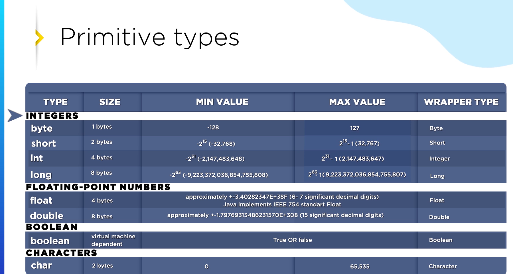

# Datatypes(Primitive DataTypes)
These are snapshots of different data types in java.

###  Primitive types.
1. Java is a strong-typed language.
2. Java compiler checks for type compatibility in code.
3. If compatibility is not matched,compiler throws error.
4. Normal decimal literal like(1.2,3.24 etc.) are considered as double.
5. Similarly, 2_000_00_000 literals are considered as integer.
6. To specify the compiler f,l,d etc. are mentioned after literal.
7. for datatype conversion, a bigger size datatype can hold smaller size datatype.
8. if we need to convert from smaller size data to bigger size data, we need to typecast.
9. In the above case,there is a chance of overflow.
10. Assigning integer literals to its wrapper class is autoboxing and vice-verse is unboxing.

###  Number System.
1. There are decimal, binary,octal and hexadecimal number system.
2. in Java numbers are by default decimal.Binary,octal and hexadecimal numbers need to be represented differently.
